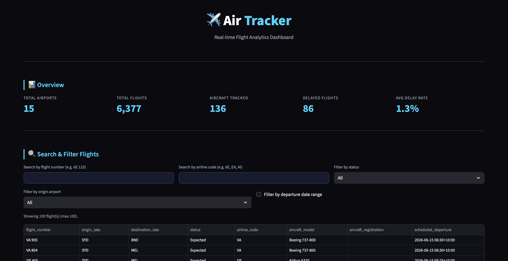

# ✈️ Air Tracker: Flight Analytics

A flight analytics dashboard built using Python, PostgreSQL, AeroDataBox API, and Streamlit.

## Project Overview

The goal of this project is to collect flight and airport data from the AeroDataBox API, store it in a PostgreSQL database, and analyze the data using SQL queries and interactive visualizations.

The dashboard allows users to explore airport information, search flights, analyze delays, and view route statistics through a simple web interface.

## Technologies Used

- Python
- PostgreSQL
- Streamlit
- Pandas
- Plotly
- Psycopg2
- AeroDataBox API
- Python Dotenv

## Database Tables

### Airport

Stores airport information such as:

- Airport name
- IATA code
- ICAO code
- City
- Country
- Timezone
- Coordinates

### Aircraft

Stores aircraft details such as:

- Registration number
- Model
- Manufacturer
- Owner

### Flights

Stores flight information including:

- Flight number
- Origin airport
- Destination airport
- Departure and arrival times
- Airline code
- Flight status

### Airport Delays

Stores delay statistics for airports such as:

- Total flights
- Delayed flights
- Average delay
- Median delay
- Cancelled flights

## Features

### Dashboard Overview

Displays KPI cards for:

- Total Airports
- Total Flights
- Aircraft Tracked
- Delayed Flights
- Average Delay Rate across airports

### Flight Search and Filtering

Users can:

- Search flights by flight number or airline code
- Filter flights by status, origin airport, and departure date range
- View flight details (including aircraft model and registration) in a table

### Airport Details Viewer

Select a single airport to display:

- City, country, IATA / ICAO codes, and timezone
- All linked flights (inbound and outbound)

### Delay Analysis

Visualizes:

- Delay percentage by airport
- Flight status distribution

### Route Leaderboards

- Busiest flight routes by flight count
- Most delayed airports by delay percentage

## SQL Analysis

The following SQL queries were implemented:

1. Total flights for each aircraft model
2. Aircraft assigned to more than 5 flights
3. Airports with more than 5 outbound flights
4. Top 3 destination airports by arrivals
5. Domestic and International flight classification
6. Most recent arrivals at DEL airport
7. Airports with no arriving flights
8. Flight status count by airline
9. Cancelled flights analysis
10. City pairs operated by multiple aircraft models
11. Delay percentage by destination airport

## Dashboard Screenshots

### Dashboard Overview

### Flight Search & Filter

### Delay Analysis

### Airport Details

### Busiest Routes

## Installation

Clone the repository:

git clone https://github.com/Jeffrey-29/air-tracker-flight-analytics.git 
cd air-tracker-flight-analytics 

Install dependencies:

pip3 install -r requirements.txt 

Create the database and load the schema:

createdb air_tracker
psql -d air_tracker -f schema.sql

Create a .env file and add your database credentials and API key.

Example:

DB_HOST=localhost
DB_PORT=5432
DB_NAME=air_tracker
DB_USER=postgres
DB_PASSWORD=your_password

API_KEY=your_api_key

Populate the database by running the ETL notebook (run all cells in order):

jupyter notebook air_tracker.ipynb

Run the Streamlit application:

streamlit run app.py 

## Project Structure

air-tracker-flight-analytics/
│
├── app.py
├── air_tracker.ipynb
├── schema.sql
├── queries.sql
├── requirements.txt
├── README.md
└── screenshots/

## Author

Jeffrey Gabriel
